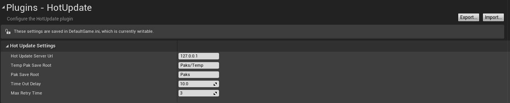
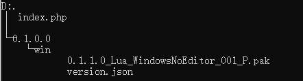
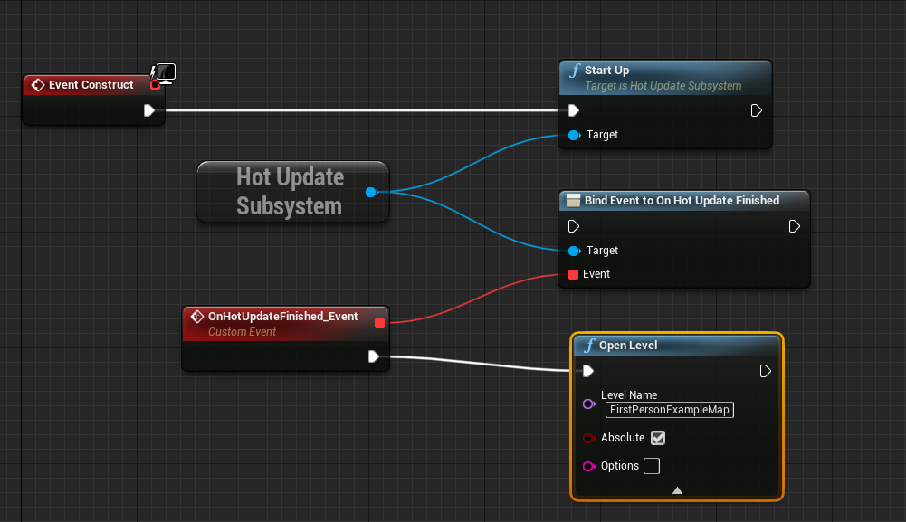

## UE4 Plugin: HotUpdate
[HotUpdate](https://github.com/crazytuzi/HotUpdate)是一个用于UE4资源热更新下载的插件，经过测试，UMG，地图和Lua都成功热更新，理论上其他uasset资源都可以，已经测试通过PC和Android，IOS待测试。目前处于测试阶段，会持续更新，欢迎提issus。制作Pak部分推荐[HotPatcher](https://github.com/hxhb/HotPatcher)。

- 首先在Project Settings - Plugins - HotUpdate下设置参数
    <br>
    
    - HotUpdateServerUrl : 热更新服务器地址
    - TempPakSaveRoot : 临时下载文件保存目录
    - PakSaveRoot : Pak保存目录
    - TimeOutDelay : 尝试重连间隔时间
    - MaxRetryTime : 尝试重连最大次数
- 然后配置Http服务器
    <br>
    
    - index.php为热更新入口，根据客户端通过Json格式传入的版本号和平台，返回对应的热更新资源Json。这里版本号可以对接项目自身CICD实现自动化。
        ```php
        <?php
        // index.php
        ini_set("display_errors", "On");

        ini_set("error_reporting",E_ALL);

        header('Content-Type:application/json; charset=utf-8');

        $data = json_decode(file_get_contents('php://input'));

        $version = $data->{"version"};

        $platform = $data->{"platform"};

        $file = $version . "/" . $platform ."/". "version.json";

        if(file_exists($file))
        {
            $json_contents = file_get_contents($file);

            echo $json_contents;
        }
        else
        {
            exit(json_encode(""));
        }
        ?>
        ```
    - 平台对应文件夹列表，可根据项目需求在源码中进行修改
        - PLATFORM_DESKTOP &&  WITH_EDITOR - editor
        - PLATFORM_WINDOWS - win
        - PLATFORM_ANDROID - android
        - PLATFORM_IOS - ios
        - PLATFORM_LINUX - linux
    - version.json中为版本对应热更新资源列表，可根据项目自身CICD实现自动化生成。
        ```json
        {
            "0.1.0.0" : [
            ],
            "0.1.1.0" : [
                {
                    "File": "0.1.1.0_Asset_WindowsNoEditor_001_P.pak",
                    "HASH": "806f2c9f104b03552145a14063648126",
                    "Size": 15116689
                },
                {
                    "File": "0.1.1.0_Lua_WindowsNoEditor_001_P.pak",
                    "HASH": "483c3342a912bf177058f0979ea52ee5",
                    "Size": 681
                }
            ]
        }
        ```
- 最后只需要在项目适当位置运行UHotUpdateSubsystem的StartUp函数即可
    <br>
    
- 相关事件列表
    - OnDownloadUpdate 下载进度
    - OnMountUpdate Mount进度
    - OnHotUpdateFinished 热更新完成
